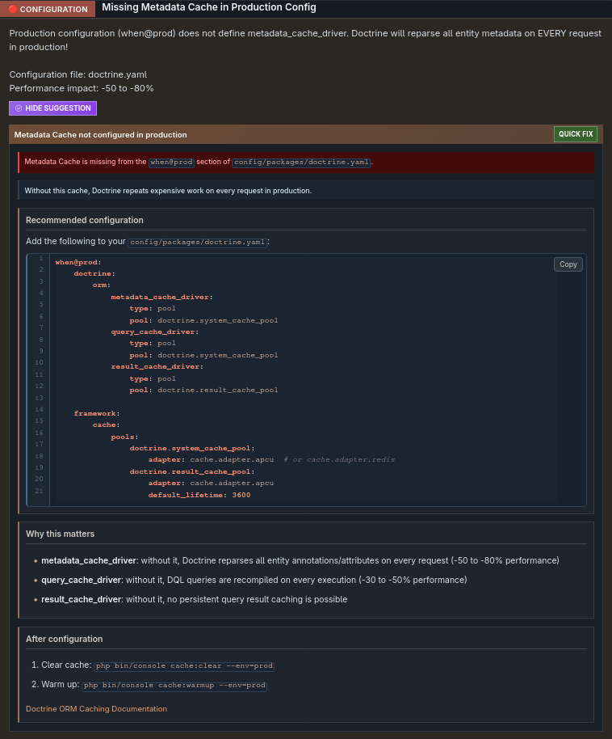
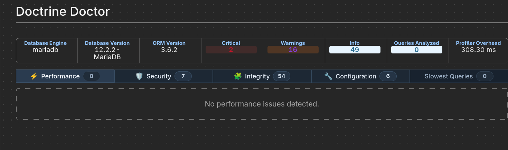
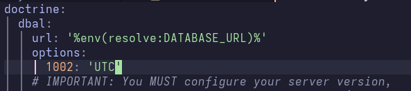
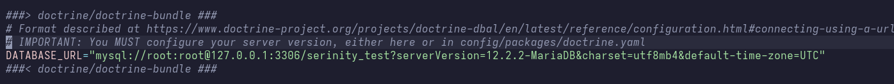

# Doctrine Doctor Fixes

## Missing Metadata Cache in Production Config



I used `redis` server as caching system, so I installed:

- `redis` server
- `redis-php` extension

```bash
# In Arch
sudo pacman -S --noconfirm redis redis-php

# Under serinity-web/project
composer require predis/predis
```

> ![NOTE]
> Or you can install [redis docker](https://hub.docker.com/_/redis)

configuring the `doctrine.yaml` file by adding:

```yaml
when@prod:
  doctrine:
    orm:
      metadata_cache_driver:
        type: pool
        pool: doctrine.system_cache_pool
      query_cache_driver:
        type: pool
        pool: doctrine.system_cache_pool
      result_cache_driver:
        type: pool
        pool: doctrine.result_cache_pool

  framework:
    cache:
      pools:
        doctrine.system_cache_pool:
          adapter: cache.adapter.redis
        doctrine.result_cache_pool:
          adapter: cache.adapter.redis
          default_lifetime: 3600
```

**Result:**



## Missing Metadata Cache in Production Config


### 1st solution

Set in Doctrine **DBAL** configuration (`config/packages/doctrine.yaml`)



And we tried using connection string


> **Option 4 doesn't work :)**

### 2nd solution

Set in MySQL configuration file (my.cnf for linux) ==> **RECOMMENDED**


> Option 1 doesn't work :)

### 3rd solution

We tried to change `MySQL` timezone into `UTC`, we get:

```bash
An exception occurred in the driver: SQLSTATE[42000] [1064] You have an error in your SQL syntax; check the manual that corresponds to your MariaDB server version for the right syntax to use near 'UTC' at line 1
```

Instead, we set PHP timezone to `CET` in `/etc/php/php.ini`:


Verifying:

```bash
<?php
echo date_default_timezone_get(); // CET
```

## Suboptimal LEFT JOIN on NOT NULL Relation


## setMaxResults() with Collection Join Detected

_with_collection_join_detected.png>)
